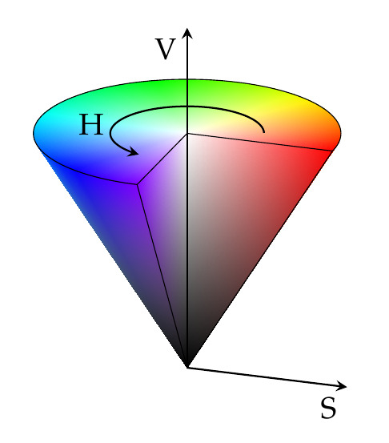

# Digital Image Processing

- Images are composed of digital picture elements called pixels
  - Each pixel has discrete spatial coordinates
- The number of pixels that fit in an image defines its <i>resolution</i>
- Images are stored in 2D arrays with each element containing a `uchar` type (1 byte: 0 to 0xFF).

##### Standard Resolution Formats

- 1280x720 HD (720p)
- 1920x1080 Full HD (1080p)
- 3840x2160 Ultra HD, 4K

### Videos

- Video is recorded and stored as a sequence of images, or <i>frames</i>, in time
  - The speed at which these images are taken is called the <i>frame rate</i>
- Common frame rates include 25, 30, and 60 fps.
- Higher frame rate causes smoother video but takes more memory and computing power

### Digital Displays

- Use <i>light emitting pixels</i> to recreate images.
- Each display pixel is made of (usually) three <i>sub-pixels</i>.
- Subpixels come in different varieties, but usually consist of red, green, and blue.
- Have a refresh rate that may be different than the frame rate of the displayed content.

### Color Representations

#### RGB (Red - Green - Blue)

- Uses the three additive primary colors

##### HSV (Hue - Saturation - Vibrance)

- Hue controls color
- Saturation controls the amount of white in the color (how much it "pops")
- Vibrance controls how bright the color is
- HSV cone

## PiCamera

- 8 megapixel static images at 3280x2464
- Video at 1080p30, 720p60, 640x480p90
- Uses the Python `PiCamera` library

Note: the frame rate changes with resolution because the camera and processor can only handle
a finite amount of information at once. Higher resolution uses more memory and therefore
must have lower fps to lower memory overhead.

### Common Image Processing Procedures

1. Get the image
2. Convert to grayscale (simple way is to average the RGB values)
3. Single level threshold to get a binary image
4. Crop, morph, and detect centroid (finds large regions of whitespace)

An image can also be sliced into individual RGB components and be separately processed.

5. Edge detection
   - Vectorization
   - Convolution filtering (with vertical and horizontal edge detection kernels)

## Conventional Cameras

Cameras do not have three RGB sensors but only has a brightness sensor. Once a camera captures
the photo, it applies a color filter known as a <i>Bayer filter</i>. Bayer filters filter a
pixel with a specific color and compose that image into a full RGB image by using the neighboring pixels.

